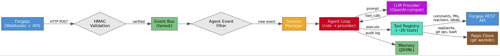
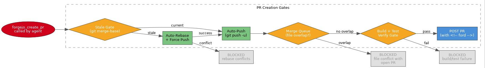
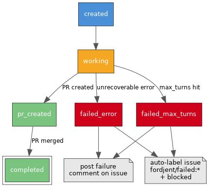
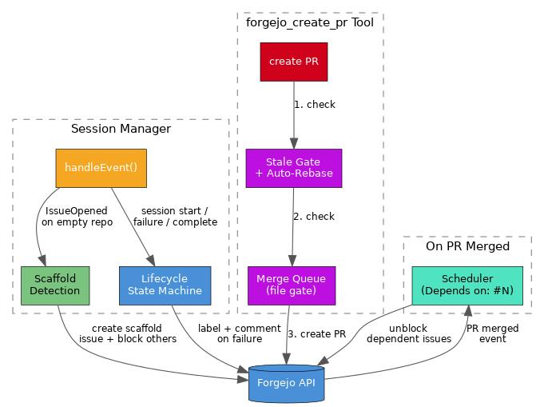

# Fordjent

A Forgejo-driven AI agent harness written in Go. Fordjent listens for Forgejo webhook events, spawns per-issue agent sessions, and uses an LLM with tool-calling to autonomously triage, comment, create issues, and submit pull requests.

## Features

- **Webhook-driven** — Receives Forgejo events via HMAC-validated HTTP webhooks
- **Session affinity** — Events for the same issue/PR route to the same agent session for serial processing
- **Role-based providers** — Detects agent role (PM, implementer, reviewer, devops, tester) from labels/titles and routes to the best LLM for that role
- **20 built-in tools** — Forgejo API, bash, file I/O, git, code search, reactions, branch/hook management, and more
- **PR creation pipeline** — Multi-gate: stale gate + auto-rebase, merge queue (file overlap), build/test/lint verify, then create PR
- **Dependency scheduler** — Parses `Depends on: #N` in issue bodies; auto-unblocks dependents when PRs merge
- **Lifecycle tracking** — SQLite state machine tracks every session; auto-labels issues on failure
- **Cost tracking + budget** — Per-session/repo/month cost in SQLite; enforceable spend limits
- **Context compaction** — Auto-truncates old turns at configurable threshold to avoid context overflow
- **Auto-rebase** — Stale gate detects when a branch is behind `origin/main` and rebase + force-pushes automatically
- **Scaffold detection** — Blocks issues on empty repos; creates a scaffold issue first
- **Loop prevention** — Multi-layer: `<!-- ford -->` marker, bot sender filtering, branch protection, commit prefix filtering
- **Observability** — `/metrics` (Prometheus), `/status` (JSON), `/activity` (HTML), `/admin` dashboard, `/healthz`, `/readyz`
- **Crash recovery** — Session metadata persisted to SQLite; sessions survive restarts with rebase-abort cleanup
- **Config hot-reload** — Watcher polls disk and applies changes without restart
- **Single binary** — Pure Go, no CGO required (SQLite via modernc.org/sqlite)
- **Docker-ready** — Multi-stage Dockerfile and Compose stack included

## Architecture

### Event Flow



1. **Ingest** — Forgejo webhooks are validated via HMAC-SHA256
2. **Filter** — Agent-originated events (marked with `<!-- ford -->`) are dropped to prevent loops
3. **Route** — The session manager maps events to sessions by key (e.g. `org/repo/issues/42`)
4. **Process** — Each session runs a serial agent loop; role detection selects the LLM provider
5. **Act** — The LLM decides which tools to call; results feed back into the conversation
6. **Record** — Reasoning traces and tool outputs are written to JSONL audit logs

### PR Creation Pipeline



Before `forgejo_create_pr` posts to the API, it passes through multiple gates:
1. **Stale gate** — Detects if the branch is behind `origin/main`; auto-rebases and force-pushes
2. **Auto-push** — Ensures the branch is pushed to the remote
3. **Merge queue** — Checks for file overlap with other open PRs; blocks if conflicts exist
4. **Build/test/lint verify** — Runs `go build`, `go test`, and `golangci-lint`; blocks on failure

### Session Lifecycle



Every session tracks through a state machine: `created` → `working` → `pr_created` → `completed`. On failure (max turns or error), the lifecycle system auto-labels the issue `fordjent/failed:*` + `blocked` and posts a comment explaining the failure.

### Coordination Layer



Four coordination subsystems work together around the session manager:
- **Scaffold detection** — Blocks issues on empty repos; creates a `[scaffold]` issue first
- **Stale gate** — Prevents stale-branch PRs; auto-rebases when possible
- **Merge queue** — File-gate prevents PRs that conflict with open PRs
- **Scheduler** — On PR merge, scans dependent issues and transitions `blocked` → `ready`

## Quick Start

### Binary

```bash
go build -o fordjent ./cmd/fordjent

# Set required secrets
export FORGEJO_TOKEN=your-repo-scoped-token
export OPENAI_API_KEY=your-api-key

# Edit config (set forgejo URL, repository, etc.)
cp fordjent.yaml my-config.yaml

./fordjent -config my-config.yaml
```

### Docker Compose

```bash
cp .env.example .env
# Edit .env with your tokens and webhook secret

# Edit fordjent.yaml to point at your Forgejo instance
docker compose up -d
```

The Compose stack binds to `127.0.0.1:8080` by default — put it behind a reverse proxy (Caddy, Traefik) or expose it directly if Forgejo is on the same host. See [`docs/deployment.md`](docs/deployment.md) for systemd and production options.

### Forgejo Setup

1. Go to **Repository → Settings → Webhooks → Add Webhook**
2. Set **Target URL** to `http://your-host:8080/acp/v1/events`
3. Set **Secret** to match `webhook.secret` in your config
4. Select events: `issues`, `issue_comment`, `pull_request`, `pull_request_review_comment`
5. Create a repository-scoped access token and set it as `FORGEJO_TOKEN`

## Tools

The agent has access to 20 tools exposed via OpenAI function calling:

### Forgejo API Tools

| Tool | Description |
|------|-------------|
| `forgejo_comment` | Post comments on issues and pull requests |
| `forgejo_create_issue` | Create new issues (with dedup check and dependency linking) |
| `forgejo_list_issues` | List and filter issues in a repository |
| `forgejo_get_issue` | Get issue or PR details by number |
| `forgejo_create_pr` | Create pull requests (stale gate → merge queue → verify gate) |
| `forgejo_merge_pr` | Merge a PR (mergeability check + human approval gate; bot PRs auto-bypass) |
| `forgejo_list_prs` | List pull requests in a repository |
| `forgejo_search_code` | Search code within a repository |
| `forgejo_add_reaction` | Add emoji reactions to issues/comments |
| `forgejo_list_branches` | List branches with protection status |
| `forgejo_delete_branch` | Delete a branch (e.g., after merge) |
| `forgejo_list_hooks` | List webhooks for a repository |
| `forgejo_create_hook` | Create a webhook |
| `forgejo_delete_hook` | Delete a webhook |
| `forgejo_list_files` | List files/directories in a repo |
| `forgejo_pr_files` | List files changed in a PR |
| `forgejo_list_collabs` | List repository collaborators |
| `forgejo_version` | Get the Forgejo server version |
| `forgejo_user` | Get the currently authenticated user |
| `forgejo_create_token` | Create an access token |

### Local Tools

| Tool | Description |
|------|-------------|
| `bash` | Execute shell commands in the repo directory (protected branch push blocked) |
| `read_file` | Read file contents (with offset/limit; batch mode via `paths` array) |
| `write_file` | Create or overwrite files in the repository |
| `git` | Execute git operations (push blocked; auto-push after commit on feature branches) |

All Forgejo API tools sanitize repository names via per-segment `url.PathEscape` to prevent URL injection. The `git` tool blocks push to protected branches — the agent creates PRs via `forgejo_create_pr` instead.

## Configuration

Configuration is a single YAML file with environment variable expansion via `${VAR}` syntax in any field.

```yaml
server:
  host: "0.0.0.0"
  port: 8080

webhook:
  secret: "${WEBHOOK_SECRET}"

forgejo:
  url: "${FORGEJO_URL}"
  token: "${FORGEJO_TOKEN}"
  admin_token: "${FORGEJO_ADMIN_TOKEN}"   # For admin API calls (optional)
  rate_limit: 60

agent:
  max_sessions: 25
  idle_timeout: "4h"
  workdir: "/var/lib/fordjent/work"
  max_turns: 75                            # Default turn budget per session
  max_turns_pm: 15                         # PM sessions get fewer turns
  max_turns_implementer: 50                # Implementer sessions get more
  commit_prefix: "[agent-automation]"
  context_window: 131072                   # Token window size for compaction
  compaction_threshold: 0.85              # Compact when 85% full
  compaction_keep_turns: 8                # Keep last N turns on compaction
  enable_lifecycle: true                   # Track session state machine
  enable_stale_gate: true                  # Auto-rebase stale branches
  enable_scaffold_detection: true          # Block issues on empty repos
  enable_session_recovery: true            # Resume sessions after crash
  enable_context_injection: true           # Inject issue context into prompt
  enable_auto_collaborator: true           # Auto-add agent as collaborator
  session_timeout: "30m"
  role_providers:                          # Route roles to specific providers
    pm: "openai"
    reviewer: "openai"
    implementer: "openai"

budget:
  enabled: false
  max_session_cost: 0.50                  # USD per session
  max_monthly_cost: 10.00                 # USD per month

providers:
  - name: "openai"
    api_base: "${OPENAI_API_BASE:-https://api.openai.com/v1}"
    api_key: "${OPENAI_API_KEY}"
    model: "${OPENAI_MODEL:-gpt-4o-mini}"
    max_tokens: 16384
    request_timeout: "60s"
    max_retries: 3
    retry_base_delay: "2s"
    retry_max_delay: "30s"
    max_concurrent_llm_calls: 3
    cost_per_1m_input_tokens: 0.30
    cost_per_1m_output_tokens: 1.20

events:
  - "issues"
  - "issue_comment"
  - "pull_request"
  - "pull_request_review_comment"

session_key_template: "{{.Repository}}/issues/{{.IssueNumber}}"

security:
  protected_branches: ["main", "master"]
  require_pr_for_workflows: true
  filter_agent_events: true
  admin_token: "${ADMIN_TOKEN}"            # Protects admin endpoints

memory:
  enabled: true
  compaction_cron: "0 2 * * *"
  compaction_path: "docs/issues"

database:
  path: ""                                # Defaults to sessions.db next to workdir

log_level: "info"
```

See [`fordjent.yaml`](fordjent.yaml) for the full reference with comments.

### Emoji Reaction Protocol

The agent uses Forgejo reactions to communicate status:

| Reaction | Meaning |
|----------|---------|
| 👀 | Agent has seen the event |
| ⏳ | Agent is processing |
| ✅ | Agent finished successfully |
| ❌ | Agent encountered an error |

## Project Structure

```
fordjent/
├── cmd/fordjent/main.go              # Entry point — wires all components
├── fordjent.yaml                      # Reference configuration
├── Dockerfile                         # Multi-stage Go build (non-root user)
├── docker-compose.yaml                # Compose stack with env secrets
├── .env.example                       # Template for environment variables
├── docs/
│   ├── deployment.md                  # Docker, systemd, backup, monitoring
│   └── diagrams/                      # Graphviz architecture diagrams
├── internal/
│   ├── agent/
│   │   ├── context.go                 # Context window tracking + compaction
│   │   └── turn.go                    # Per-turn execution with cost/latency logging
│   ├── config/config.go               # YAML config with env expansion, hot-reload
│   ├── cost/cost.go                   # SQLite cost tracker + budget enforcement
│   ├── event/event.go                 # Event types, bus (fanout + backpressure)
│   ├── forgejo/client.go              # Forgejo REST API client
│   ├── lifecycle/lifecycle.go         # Session state machine, failure labeling
│   ├── memory/memory.go               # JSONL audit log + git notes memory
│   ├── mergequeue/queue.go            # File-gate merge queue
│   ├── metrics/metrics.go             # Prometheus counters + JSON snapshot
│   ├── provider/
│   │   ├── client.go                  # OpenAI-compatible LLM client
│   │   └── retry.go                   # Exponential backoff with jitter
│   ├── scaffold/scaffold.go           # Empty-repo protection + scaffold issue
│   ├── scheduler/scheduler.go         # Dependency parser, label transitions
│   ├── sentinel/sentinel.go          # Typed sentinel errors
│   ├── session/
│   │   ├── manager.go                 # Session lifecycle, key affinity, idle reaping
│   │   ├── store.go                   # SQLite-backed session persistence
│   │   └── agent.go                   # Agent loop — LLM turns, tool dispatch
│   ├── stalegate/stalegate.go         # Git-plumbing staleness check + auto-rebase
│   ├── tool/
│   │   ├── registry.go                # Tool interface and registry
│   │   ├── adapter.go                 # Session info and agent config adapters
│   │   ├── forgejo_tools.go           # 20 Forgejo API tools
│   │   └── local_tools.go             # 4 local tools (bash, read, write, git)
│   ├── webhook/router.go              # HTTP server, HMAC, event normalization, /status
│   └── webui/webui.go                # HTML admin dashboard at /admin
└── scripts/
    └── fordjent.service               # systemd unit for bare-metal deploy
```

## Security

### Loop Prevention

Four layers prevent the agent from triggering itself in an infinite loop:

1. **`<!-- ford -->` marker** — Every comment, PR, and issue body created by the agent includes a hidden HTML marker. The webhook router detects this marker and drops the event.
2. **Bot sender filter** — Events from `fordjent[bot]` are ignored
3. **Branch protection** — The `bash` and `git` tools block pushes to `main`/`master`; agent uses feature branches + `forgejo_create_pr`
4. **Commit prefix filter** — Events from commits with `[agent-automation]` prefix are dropped

### Input Sanitization

- Repository names from LLM tool calls are sanitized via per-segment `url.PathEscape` before URL construction
- File paths in `read_file`/`write_file` are validated against path traversal (must stay inside repo root)
- Shell arguments in the `bash` tool are passed via `exec.Command` argument vector (no shell injection)
- Dangerous commands (`rm -rf /`, `mkfs`, `dd`, `shutdown`) are blocked by pattern
- Tool output is capped at a configurable byte limit (default 64KB) to prevent context bloat

### Secret Management

| Secret | Scope | Purpose |
|--------|-------|---------|
| `FORGEJO_TOKEN` | Repository-scoped | Forgejo API calls |
| `FORGEJO_ADMIN_TOKEN` | Admin-scoped | Admin API calls (optional) |
| Provider API key | LLM provider | Model inference |
| `webhook.secret` | Shared HMAC | Webhook authenticity |
| `security.admin_token` | Fordjent admin | Protects `/admin`, `/status` endpoints |

Secrets are injected via environment variables and expanded in config with `${VAR}` syntax. Never commit secrets to the repository.

## Monitoring & Operations

Fordjent exposes HTTP endpoints on the configured port:

| Endpoint | Purpose |
|----------|---------|
| `/healthz` | Liveness probe — returns `ok` |
| `/readyz` | Readiness probe — returns `ready` |
| `/metrics` | Prometheus text-format metrics |
| `/status` | JSON snapshot: costs, lifecycle, metrics |
| `/activity` | HTML activity feed (recent sessions) |
| `/admin` | HTML admin dashboard |

### Prometheus Metrics

```
fordjent_events_total          — webhook events received
fordjent_sessions_total        — cumulative sessions created
fordjent_sessions_active       — gauge of current sessions
fordjent_tool_calls_total      — all tool executions
fordjent_llm_calls_total       — all LLM calls
fordjent_llm_retries_total    — cumulative LLM retries
fordjent_tokens_total{type}    — input/output token counts
fordjent_cost_total_total      — cumulative spend in USD
```

### Deployment

See [`docs/deployment.md`](docs/deployment.md) for Docker Compose with reverse-proxy, systemd installation, backup strategy, and monitoring.

## Development

### Prerequisites

- Go 1.25+
- A running Forgejo instance (for integration testing)
- An OpenAI-compatible LLM endpoint

### Building & Testing

```bash
go build -o fordjent ./cmd/fordjent

# Run all tests with race detector
go test -race -count=1 ./...

# Run a specific package
go test -v -race ./internal/session/...
```

The test suite includes **112+ tests** covering all packages with `-race` clean.

### Adding a Tool

1. Create a struct implementing the `tool.Tool` interface:

```go
type myTool struct {
    adapter *tool.ForgejoAdapter
}

func (t *myTool) Name() string         { return "my_tool" }
func (t *myTool) Description() string  { return "Does something useful" }
func (t *myTool) Parameters() map[string]interface{} { /* JSON Schema */ }
func (t *myTool) Execute(ctx context.Context, args json.RawMessage) (string, error) {
    // Implementation
}
```

2. Register it in `tool.NewRegistry()` (in `registry.go`)
3. The tool is automatically exposed to the LLM via function calling

### Running with Docker

The image is built from a pinned `golang:1.25-alpine` base, runs as a non-root `fordjent` user, and stores state in `/var/lib/fordjent`.

```bash
# Build and start
docker compose up -d

# View logs
docker compose logs -f

# Health check
curl http://localhost:8080/healthz

# Status dashboard
curl http://localhost:8080/status | jq .
```

## Roadmap

- [x] **Observability** — Prometheus metrics, `/readyz`, `/status`, `/admin` dashboard
- [x] **Persistence** — SQLite-backed session state for crash recovery
- [x] **Intelligence** — Role-based provider routing, context compaction, dependency scheduling
- [x] **Coordination** — Merge queue, stale gate + auto-rebase, scaffold detection, lifecycle tracking
- [x] **Cost tracking** — Per-session/repo/month cost with budget enforcement
- [ ] **Multi-node** — Redis event bus for horizontal scaling
- [ ] **CI integration** — Forgejo Actions runner integration for test-gated merges
- [ ] **Summarization compaction** — LLM-based context summarization instead of truncation
- [ ] **Subagent orchestration** — Spawn explore/research agents for complex tasks

## License

MIT
